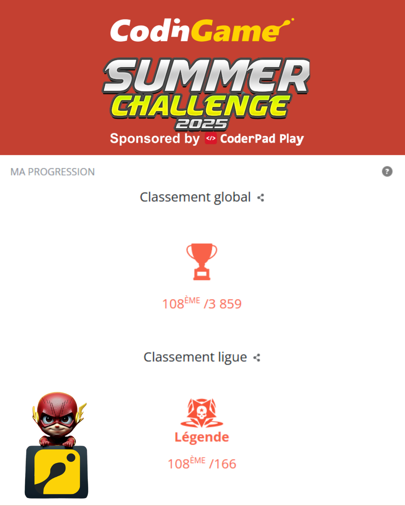

# 💦 CodinGame Summer Challenge 2025 – IA JavaScript



## 🏁 Résultat final

* 🎯 **108ᵉ / 3 859 au classement global**
* 🧠 **108ᵉ / 166 en ligue Légende**

---

## 📌 Présentation

Ce dépôt contient mon intelligence artificielle codée en **JavaScript vanilla** pour le **Summer Challenge 2025** sur [CodinGame](https://www.codingame.com/).
Objectif du jeu : **contrôler le plus de territoire** ou **éliminer les agents ennemis avec des attaques à l’eau**.

---

## ⚙️ Fonctionnement de l'IA

### 🔍 Approche utilisée

* **Pré-calcul BFS** pour les distances ennemies (optimisation mémoire avec `Int32Array`)
* **Génération combinée des actions** par agent (mouvements + tirs + bombes + repli)
* **Évitement dynamique des collisions**
* **Simulation des combinaisons possibles** avec une logique de type **minimax**
* **Évaluation multifacteurs** :

  * Score de territoire
  * Gain de wetness
  * Passage à 50 ou 100 de wetness (stratégie d’élimination)
* **Choix final** basé sur la pire réponse possible de l’adversaire (logique défensive)

---

## 🧠 Architecture du code

Le code est contenu dans un seul fichier et structuré par blocs logiques :

| Section                   | Description                                                       |
| ------------------------- | ----------------------------------------------------------------- |
| **Constantes**            | Définissent les limites du jeu (taille, agents, etc.)             |
| **Structures de données** | Représentation de l’état du jeu et des commandes                  |
| **Utilitaires CPU**       | Gestion du temps pour respecter la limite de 50ms                 |
| **BFS & scoring**         | Calcul des distances et de la zone de contrôle                    |
| **Actions IA**            | Déterminent les meilleurs mouvements, tirs et bombes              |
| **Simulation**            | Simule les combinaisons de commandes pour en déduire la meilleure |
| **Boucle principale**     | Lit les entrées, prend la décision, affiche la sortie             |

---

## 🔥 Mécanismes clés du jeu

* **Grille avec obstacles et couvertures** (basse ou haute)
* **Agents avec wetness** (100 = éliminé)
* **Portée optimale vs portée étendue** pour les tirs
* **Bombes à zone** avec évaluation anti-friendly-fire
* **Priorité des actions par tour** :

  * `MOVE` > `HUNKER_DOWN` > `SHOOT` / `THROW` > Résolution des morts

---

## 🏗️ Structure minimale du dépôt

```
/
├── README.md
├── classement.png   # Résultat du classement        
└── main.js    # Code complet de l'IA CodinGame 
```

---

## ▶️ Lancer le code

Le fichier `main.js` est directement exécutable sur CodinGame.
Il respecte :

* Temps max 1000 ms au tour 1
* Temps max 50 ms par tour
* Pas de dépendances externes
* Optimisé pour la version légende du challenge

---

## 🎥 Replay

[🔗 Voir une partie en ligue Légende](https://www.codingame.com/replay/851109929)

---

## 📣 Remerciements

* Merci à [CodinGame](https://www.codingame.com/) pour l'organisation de ce challenge intense et stimulant
* Merci à la communauté pour les feedbacks et les échanges techniques

---

## 🧠 Ce que j’ai appris

* Optimiser des IA temps réel sous contraintes strictes
* Combiner heuristiques + simulation pour un score robuste
* Préparer du code compétitif maintenable, lisible et réutilisable
